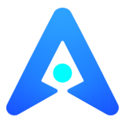
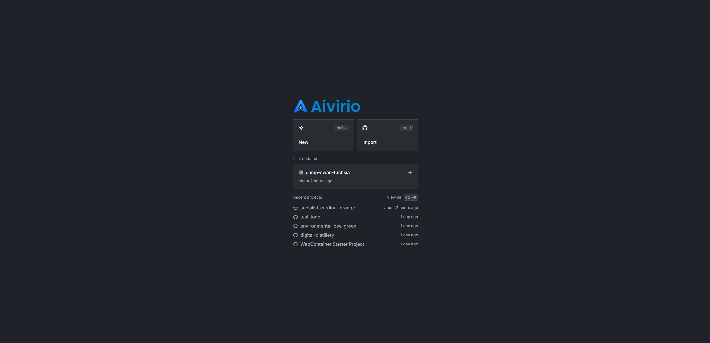
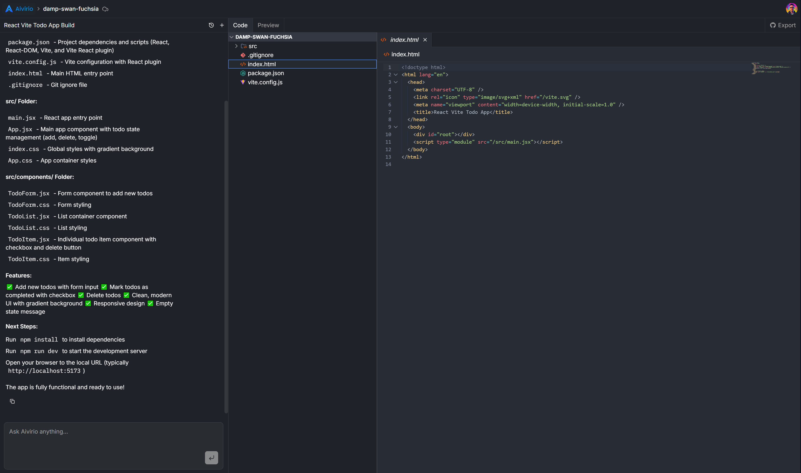
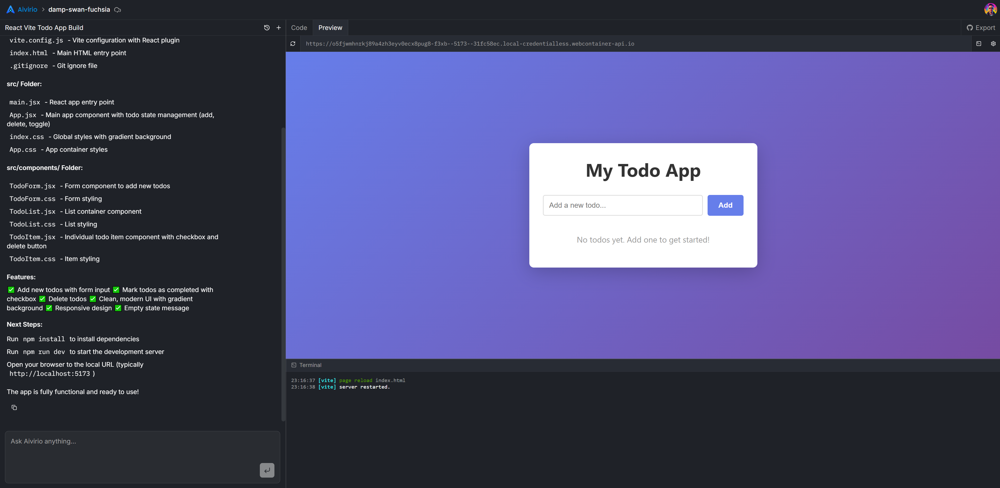

<div style="text-align: center; display: flex; justify-content: center; align-items: center; flex-direction: row; gap: 16px; ">

<h1 style="font-size: 72px;">Aivirio</h1>
</div>

<p align="center">
  <b>AI-powered development environment that can understand, edit, run, and sync entire projects — directly in the browser.</b>
</p>

<p align="center">
  
  
  
  
  
</p>

---

## 📑 Table of Contents

- [Why Aivirio Exists](#-why-aivirio-exists)
- [Core Capabilities](#-core-capabilities)
- [Screenshots & Demo](#-screenshots--demo)
- [Tech Stack](#-tech-stack)
- [Quick Start](#-quick-start)
- [Environment Variables](#-environment-variables)
- [How It Works](#-how-it-works)
- [Development](#-development)
- [Documentation](#-documentation)
- [License](#-license)

---

## ✨ Why Aivirio Exists

Most AI tools help you write code.

**Aivirio helps you build and run entire projects**, where AI:

- Sees the whole file system
- Creates and edits real files
- Understands project architecture
- Runs Node.js applications in the browser
- Syncs changes with GitHub

---

## 🛠️ Core Capabilities

- Import existing GitHub repositories into a live workspace
- AI-powered file creation, editing, and refactoring
- Full-featured CodeMirror editor with AI assistance
- Browser-based Node.js runtime via WebContainer
- GitHub synchronization (import/export)
- Conversational AI with access to your real project files

---

## 🎥 Screenshots

<div style="text-align: center; display: flex; justify-content: center; align-items: center; flex-direction: column; gap: 16px; ">
<p>Projects list</p>

</div>

<div style="text-align: center; display: flex; justify-content: center; align-items: center; flex-direction: column; gap: 16px; ">
<p>Editor</p>

</div>

<div style="text-align: center; display: flex; justify-content: center; align-items: center; flex-direction: column; gap: 16px; ">
<p>Preview</p>

</div>


---

## 🧩 Tech Stack

- **Next.js (App Router)** + React + TypeScript
- **Convex** — realtime backend & data layer
- **Clerk** — authentication
- **Inngest** — background jobs
- **Anthropic Claude** — AI code agent
- **CodeMirror** — code editor
- **WebContainer API** — browser Node.js runtime
- **Octokit** — GitHub integration

---

## ⚡ Quick Start

```bash
git clone https://github.com/AnBoyvan/aivirio.git
cd aivirio
npm install
npm run dev
```

You will need accounts for: Clerk, Convex, Anthropic, Inngest, GitHub OAuth.

---

## 🔐 Environment Variables

Create a `.env.local` file:

```
NEXT_PUBLIC_CONVEX_URL=
CONVEX_INTERNAL_KEY=

CLERK_PUBLISHABLE_KEY=
CLERK_SECRET_KEY=
CLERK_JWT_ISSUER_DOMAIN=

ANTHROPIC_API_KEY=
FIRECRAWL_API_KEY=

INNGEST_EVENT_KEY=
INNGEST_SIGNING_KEY=
```

---

## ⚙️ How It Works

1. Files are stored in Convex
2. AI agent accesses files through tools
3. Inngest handles long-running jobs (GitHub sync, AI tasks)
4. WebContainer runs the project in the browser
5. Changes can be pushed back to GitHub

For deep technical details see: `docs/architecture.md`

---

## 🧪 Development

```bash
npm run dev
npx convex dev
npx inngest-cli dev
```

Formatting and linting via **Biome**.

---

## ℹ️ About this project

This repository is a portfolio demonstration.

See: `docs/description.md`

## 📚 Documentation

Full technical documentation and architecture breakdown:  
`docs/architecture.md`


